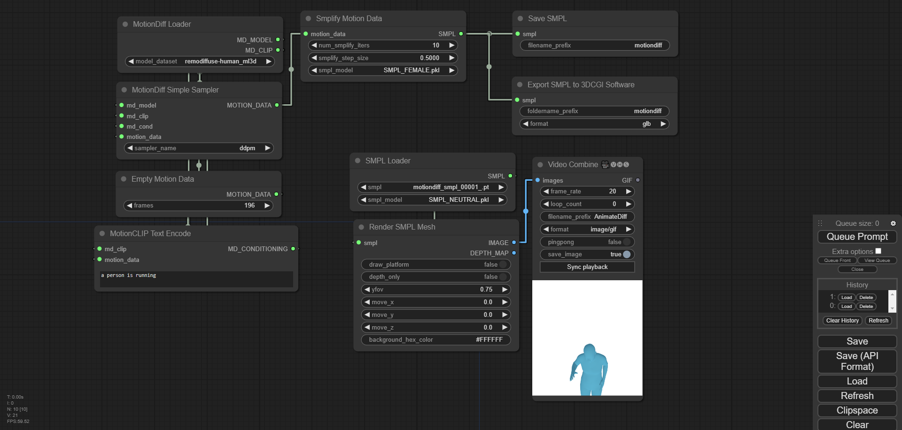

# ComfyUI MotionDiff
Implementation of 4DHuman, MotionGPT, MDM, MotionDiffuse and ReMoDiffuse into ComfyUI

# Installation:
## Installing prerequisites on Ubuntu (and maybe other Linux distros)
```
sudo apt-get install libglfw3-dev libgles2-mesa-dev freeglut3-dev
```
## Using ComfyUI Manager (recommended):
Install [ComfyUI Manager](https://github.com/ltdrdata/ComfyUI-Manager) and do steps introduced there to install this repo.

## Alternative:
If you're running on Linux, or non-admin account on windows you'll want to ensure `/ComfyUI/custom_nodes` and `comfyui_controlnet_aux` has write permissions.

There is now a **install.bat** you can run to install to portable if detected. Otherwise it will default to system and assume you followed ConfyUI's manual installation steps. 

If you can't run **install.bat** (e.g. you are a Linux user). Open the CMD/Shell and do the following:
  - Navigate to your `/ComfyUI/custom_nodes/` folder
  - Run `git clone https://github.com/Fannovel16/comfyui_controlnet_aux/`
  - Navigate to your `comfyui_controlnet_aux` folder
    - Portable/venv:
       - Run `path/to/ComfUI/python_embeded/python.exe -s -m pip install -r requirements.txt`
	- With system python
	   - Run `pip install -r requirements.txt`
  - Start ComfyUI

# Examples
## 3D Pose Estimation from 4DHuman

https://github.com/Fannovel16/ComfyUI-MotionDiff/blob/main/examples/4dhuman.json

## Generate and render
https://github.com/Fannovel16/ComfyUI-MotionDiff/blob/main/examples/full_motiondiff_example.json

https://github.com/Fannovel16/ComfyUI-MotionDiff/assets/16047777/842a6720-5f5d-4f14-813f-f25ccc2d8a72


There are two stickmen outputs: pseudo-openpose and real openpose. The former costs less time but doesn't have head, lacks depth and doesn't exactly match Openpose format while the real one is better overall but requires gradient-based optimization. Some important parameters:
* frames: The amount of frames will be generated. All models are currently trained on HumanML3D which is a 20 fps dataset.
*  smplifiy_iters: Optimization iterations in the converting process from motion data to SMPL, kinda like train step
*  smplify_step_size: Kinda like learning rate. A good loss is around 1 to 15 for camera translation optimization and 1e+6 to 2e+6 for the second step. You can try to lower the step size and increase iters, similar to training ig
*  smpl_model: SMPL model for visualization. Only 1.0.0 models (10 shape PCs) are tested. You can place your own models (.pkl files, chumpy must be removed) in ComfyUI-MotionDiff/smpl_models
* yfov: vertical fov in radians, kinda the inverse of zoom. Explaination by ChatGPT:
> The floating-point vertical field of view in radians refers to the angle of the vertical viewing area in a graphical application or game. It determines how much of the vertical space is visible to the viewer. The value is usually specified in radians, which is a unit of measurement for angles. A larger value will result in a wider vertical viewing area, while a smaller value will result in a narrower vertical viewing area.


P/s: Depth map from SMPL render might create half-naked women when used with ControlNet. My theory is that it learned half-naking pattern in the depth map

## Saving and loading SMPL

Workflow: https://github.com/Fannovel16/ComfyUI-MotionDiff/blob/main/examples/save_and_load.json

`Save SMPL` node saves SMPL data as `.pt` file

`Export SMPL to 3DCGI Software` saves meshes to a folder containing mesh files can be imported to softwares like Blender, Unreal Engine, Unity, etc

Both nodes save the result in Comfy's output folder

`Load SMPL` get the files from Comfy's input folder. You have to copy `.pt` files from input folder to output folder
